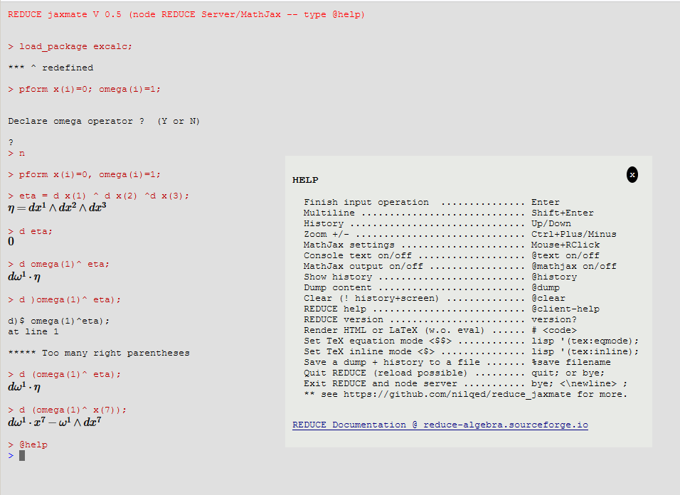

# reduce_jaxmate
REDUCE in browser (scratchpad, MathJax) (:warning: :construction:)

On Linux change 'redcsl.bat' to 'redcsl' in 'reduce_server.js':

--> reduce_server.js:const repl = spawn('redcsl', ['--nogui']);